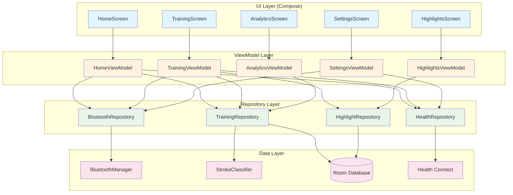
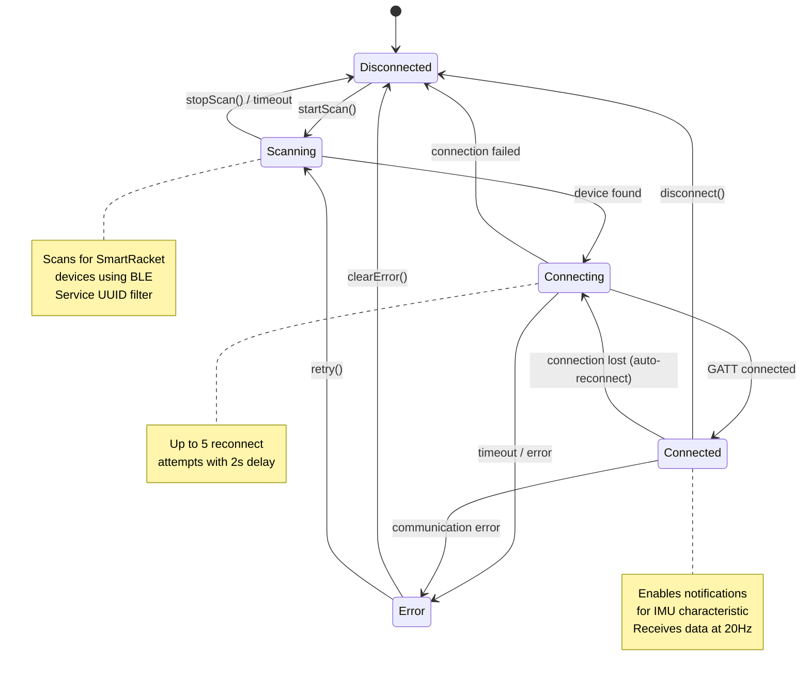
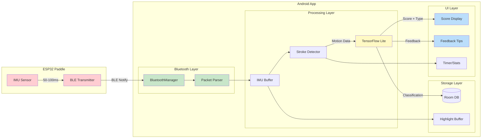
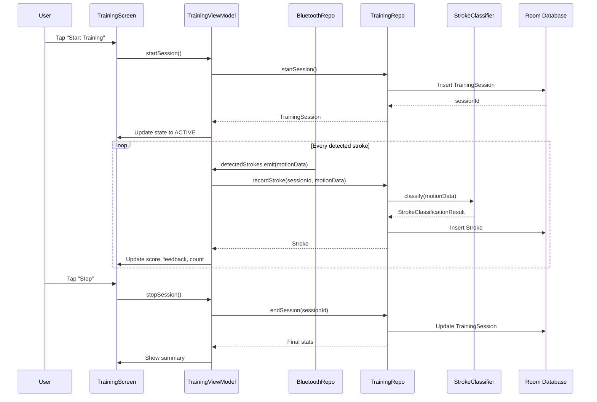
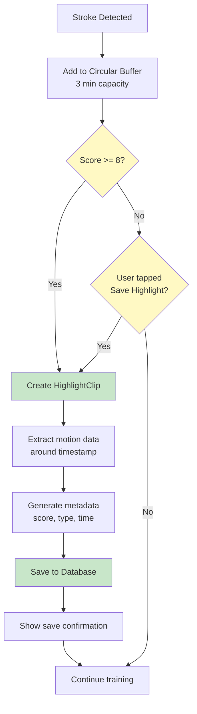
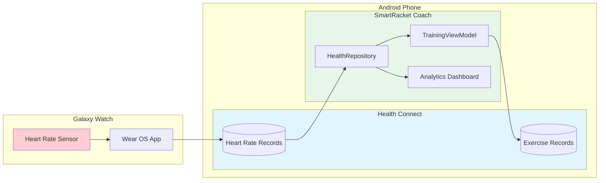

# SmartRacket Architecture Diagrams

This document contains Mermaid diagrams for the SmartRacket Coach app architecture.

## MVVM Architecture Overview

## Bluetooth State Machine

## Real-Time Data Flow Pipeline

## Training Session Flow

## Highlight Capture Flow

## Health Connect Integration

---

To render these diagrams:
1. Use a Mermaid-compatible Markdown viewer
2. Or paste into https://mermaid.live
3. Or use VS Code with Mermaid extension

