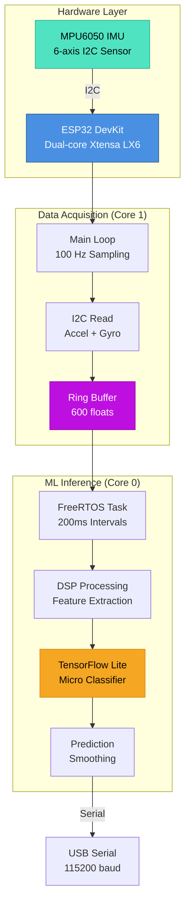

# ESP32 + MPU6050 Motion Detection with Edge Impulse

Real-time 6-axis motion detection using ESP32, MPU6050 IMU, and Edge Impulse machine learning.

## 🎯 Features

- **6-Axis IMU Data:** Accelerometer (ax, ay, az) + Gyroscope (gx, gy, gz)
- **100 Hz Sampling:** High-frequency motion capture (10ms intervals)
- **Real-time ML Inference:** Edge Impulse TensorFlow Lite Micro
- **Dual-Core Processing:** FreeRTOS tasks for parallel inference
- **Adaptive Smoothing:** 70% confidence threshold for stable predictions

## 📊 System Architecture



### Data Flow Mapping

- **Hardware Layer:**
  - `ESP32`: Target board (ESP32 DevKit v1 or similar)
  - `MPU6050`: Connected via I2C (SDA: GPIO 21, SCL: GPIO 22)

- **Sampling Loop:** [`loop()` function, lines 193-243]
  - Runs on Core 1 (default Arduino core)
  - Reads sensor at precise 10ms intervals using `micros()`
  - Writes to shared `buffer[]` array (thread-safe via ring buffer pattern)

- **ML Inference:** [`run_inference_background()` task, lines 121-189]
  - Runs on Core 0 (dedicated FreeRTOS task)
  - Copies buffer snapshot to `inference_buffer[]`
  - Executes Edge Impulse DSP + TFLite inference
  - Outputs predictions with timing metrics

## 🔌 Hardware Wiring

### MPU6050 → ESP32 Connections

| MPU6050 Pin | ESP32 Pin |        Function                |
|-------------|-----------|--------------------------------|
| VCC         | 3.3V      | Power supply                   |
| GND         | GND       | Ground                         |
| SDA         | GPIO 21   | I2C Data (default)             |
| SCL         | GPIO 22   | I2C Clock (default)            |
| XDA         | -         | Not connected                  |
| XCL         | -         | Not connected                  |
| AD0         | -         | I2C Address (default 0x68)     |
| INT         | -         | Optional interrupt pin         |

**Note:** MPU6050 must be powered with **3.3V** (ESP32 logic level). Some breakout boards have onboard voltage regulators for 5V tolerance.

## 📦 Dependencies

Install via Arduino Library Manager or PlatformIO:

```ini
# Arduino Libraries
- Adafruit MPU6050 (>= 2.2.4)
- Adafruit Unified Sensor (>= 1.1.9)
- Adafruit BusIO (>= 1.14.1)

# Edge Impulse
- motion_detection_inferencing.h (generated from your Edge Impulse project)
```

### Edge Impulse Setup

1. Train your model on [Edge Impulse Studio](https://studio.edgeimpulse.com)
2. Export as **Arduino library**
3. Extract to `Arduino/libraries/` directory
4. Model must have these specs:
   - **Input axes:** 6 (ax, ay, az, gx, gy, gz)
   - **Window:** 1000ms
   - **Sample rate:** 100 Hz
   - **Format:** Time series data

## 🚀 Quick Start

### 1. Install Libraries
```bash
# Arduino CLI
arduino-cli lib install "Adafruit MPU6050" "Adafruit Unified Sensor"

# Or via Arduino IDE: Tools → Manage Libraries
```

### 2. Configure Board
```bash
# Select board in Arduino IDE
Tools → Board → ESP32 Arduino → ESP32 Dev Module

# Settings:
- Upload Speed: 921600
- CPU Frequency: 240 MHz (WiFi/BT)
- Flash Frequency: 80 MHz
- Partition Scheme: Default 4MB with spiffs
```

### 3. Upload Sketch
1. Connect ESP32 via USB
2. Select correct COM port
3. Click Upload
4. Open Serial Monitor (115200 baud)

### 4. Expected Output
```
Edge Impulse Inferencing Demo
MPU6050 initialized
Accelerometer range: ±2G
Gyroscope range: ±250°/s
Predictions (DSP: 12 ms., Classification: 45 ms., Anomaly: 2 ms.): walking [ 8, 1, 0 ]
Predictions (DSP: 11 ms., Classification: 44 ms., Anomaly: 2 ms.): walking [ 9, 0, 0 ]
Predictions (DSP: 12 ms., Classification: 46 ms., Anomaly: 2 ms.): idle [ 0, 9, 0 ]
```

## 🔧 Configuration

### Sensor Ranges

Edit constants in sketch to match your Edge Impulse training data:

```cpp
#define MAX_ACCEPTED_RANGE  2.0f    // Accelerometer ±2G
#define MAX_GYRO_RANGE      250.0f  // Gyroscope ±250°/s
```

**Available MPU6050 Ranges:**
- Accelerometer: ±2G, ±4G, ±8G, ±16G
- Gyroscope: ±250°/s, ±500°/s, ±1000°/s, ±2000°/s

### Inference Frequency

Adjust prediction rate (default: 5 Hz):

```cpp
static uint32_t run_inference_every_ms = 200;  // 200ms = 5 predictions/sec
```

### Debug Mode

Enable detailed neural network output:

```cpp
static bool debug_nn = true;  // Shows DSP features and layer activations
```

## 📈 Performance

| Metric | Value |
|--------|-------|
| **Sampling Rate** | 100 Hz (10ms interval) |
| **Inference Rate** | 5 Hz (200ms interval) |
| **DSP Time** | ~12 ms |
| **Classification Time** | ~45 ms |
| **Total Latency** | ~60 ms |
| **Memory Usage** | ~80 KB SRAM (buffers + TFLite arena) |

## 🐛 Troubleshooting

### MPU6050 Not Detected
```
Error: "Failed to initialize MPU6050! Check wiring."
```
**Solutions:**
1. Verify I2C wiring (SDA/SCL swapped?)
2. Check I2C address (use I2C scanner sketch)
3. Ensure 3.3V power supply
4. Add 4.7kΩ pullup resistors to SDA/SCL if using long wires

### Compilation Errors
```
Error: "EI_CLASSIFIER_RAW_SAMPLES_PER_FRAME should be equal to 6"
```
**Solution:** Edge Impulse model mismatch. Retrain model with 6-axis input (ax, ay, az, gx, gy, gz).

### Memory Overflow
```
Error: "TFLite arena allocation issue"
```
**Solutions:**
1. Reduce model complexity in Edge Impulse
2. Enable static allocation (see sketch comments)
3. Use ESP32 with more SRAM (ESP32-S3 has 512KB)

### Unstable Predictions
```
Issue: Predictions rapidly switching between classes
```
**Solution:** Increase smoothing threshold:
```cpp
ei_classifier_smooth_init(&smooth, 10, 8, 0.9, 0.3);
//                                    ^ Increase from 7 to 8 or 9
```

## 📚 API Reference

### Core Functions

#### `setup()`
- Initializes Serial (115200 baud)
- Configures I2C bus
- Initializes MPU6050 with ±2G accel and ±250°/s gyro
- Validates Edge Impulse model expects 6 axes
- Starts FreeRTOS inference task on Core 0

#### `loop()`
- Samples MPU6050 at 100 Hz (10ms intervals)
- Rolls ring buffer left by 6 positions
- Writes 6 floats: `[ax, ay, az, gx, gy, gz]`
- Clamps values to configured ranges
- Uses precise timing with `micros()` + `delayMicroseconds()`

#### `run_inference_background(void *pvParameters)`
- FreeRTOS task running on Core 0
- Copies buffer snapshot every 200ms
- Runs Edge Impulse DSP + classifier
- Applies 70% smoothing (7 out of 10 predictions must agree)
- Prints predictions and timing to Serial

### MPU6050 Configuration

```cpp
mpu.setAccelerometerRange(MPU6050_RANGE_2_G);   // ±2G
mpu.setGyroRange(MPU6050_RANGE_250_DEG);        // ±250°/s
mpu.setFilterBandwidth(MPU6050_BAND_21_HZ);     // 21 Hz low-pass filter
```

## 🔬 Advanced Features

### OOP Refactoring (Future Enhancement)

Create sensor abstraction layer for multi-IMU support:

```cpp
class ISensorAdapter {
  virtual bool begin() = 0;
  virtual bool read6Axis(float accel[3], float gyro[3]) = 0;
};

class MPU6050Adapter : public ISensorAdapter {
  // Implementation
};
```

### Gyroscope Calibration

Add zero-rate offset correction at startup:

```cpp
void calibrateGyro(float offset[3], int samples = 100) {
  for (int i = 0; i < samples; i++) {
    mpu.getEvent(&accel_event, &gyro_event, &temp_event);
    offset[0] += gyro_event.gyro.x;
    offset[1] += gyro_event.gyro.y;
    offset[2] += gyro_event.gyro.z;
    delay(10);
  }
  offset[0] /= samples;
  offset[1] /= samples;
  offset[2] /= samples;
}
```

## 📄 License

Original Edge Impulse SDK: Apache License 2.0  
Modifications for ESP32 + MPU6050: Same license applies

## 🤝 Contributing

1. Test changes with different ESP32 boards (DevKit, WROOM, S3)
2. Validate against Edge Impulse models with varying window sizes
3. Add unit tests for sensor reading and buffer management
4. Document power consumption benchmarks

## 📞 Support

- **Edge Impulse Forum:** https://forum.edgeimpulse.com
- **Adafruit MPU6050 Guide:** https://learn.adafruit.com/mpu6050-6-dof-accelerometer-and-gyro
- **ESP32 Arduino Core:** https://github.com/espressif/arduino-esp32

---

**Version:** 1.0.0 (ESP32 + MPU6050 6-axis)  
**Last Updated:** December 25, 2025
